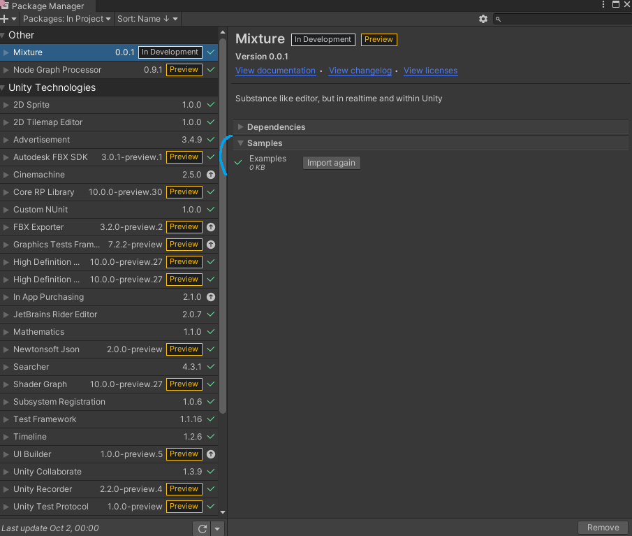
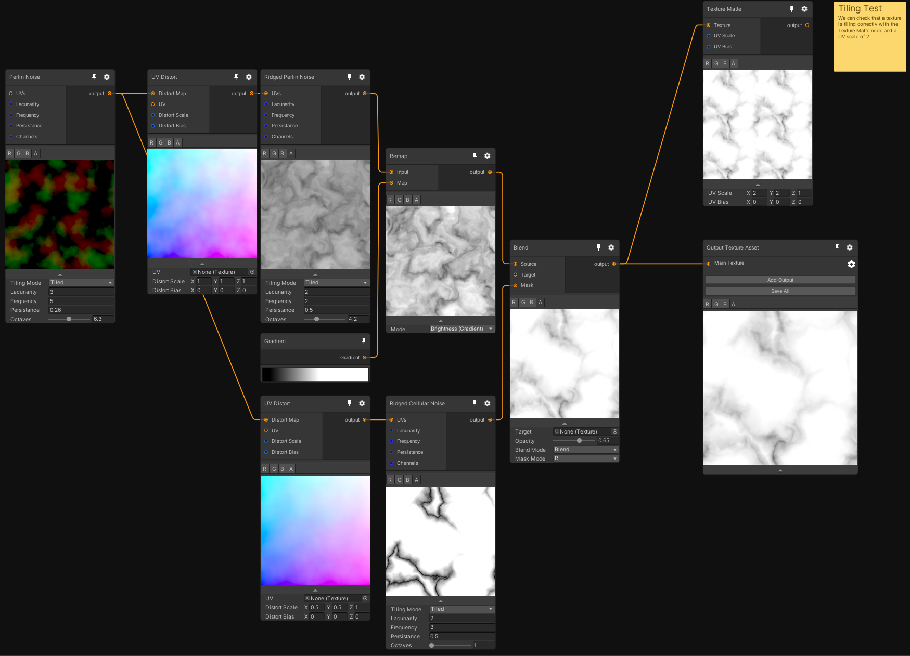

# Examples

You can find all those examples in the samples of the Mixture package. To import them in your project, open the package manager, find the mixture package and import the sample named "Examples".

## Procedural Marble Texture

Tileable marble texture, generated from distorted 2D perlin as a base to get a nice marble pattern, then we generate a "crack" pattern from a Ridged cellular noise and blend the two.

## Roof tiles from geometry

Okay, this one is really complex

## HDRP Density Volume Authoring

Ground for example generated by simply multiplying a 3D gradient with a 3D tileable perlin noise:

Here's the result with a [Density Volume](https://docs.unity3d.com/Packages/com.unity.render-pipelines.high-definition@latest/index.html?subfolder=/manual/Density-Volume.html).

And here's another example, this time with a cloud:

This is the result in the scene view:

For the cloud, I mainly use the UV distort noise to create the cloud turbulence with a mask I generate from a first Gradient Matte for the spherical mask and a second one for the "bottom" of the cloud. Then I combine the two with a Mul and use a Texture Sample node with the distorted UVs to create the final cloud.

Note that in the scene, I decreased a bit the `Fog Distance` parameter of the density volume to get this nice "opaque" cloud effect.