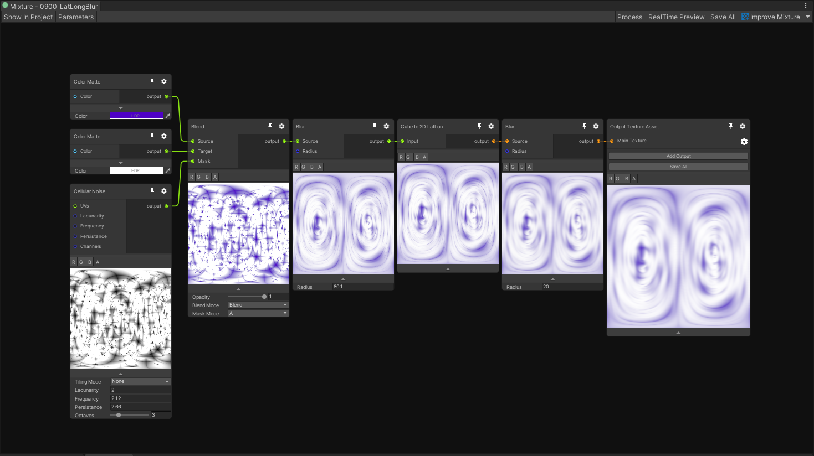
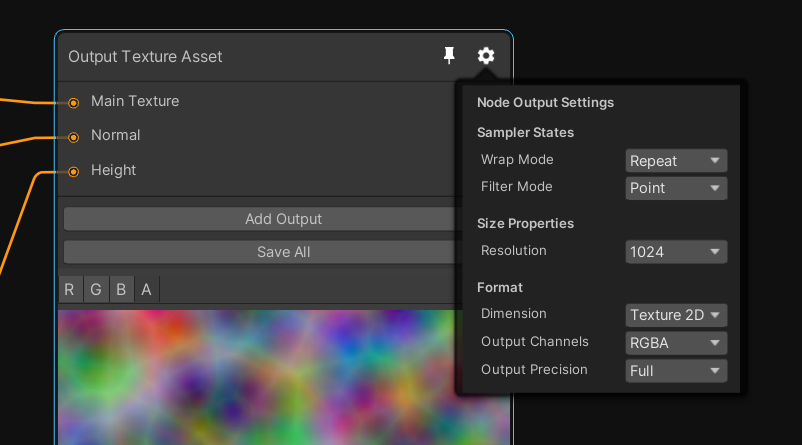

# Getting Started

Mixture assets can be created with the context menu from the **Project Window**:

The resulting asset will be saved as a texture with the small mixture icon (Erlenmeyer flask) on the bottom left corner of the asset image to indicate that it's a mixture asset.

Note that the color of the icon will will be purple for **Baked** and lime green for  **Static** Mixtures.

## The Editor

You can enter the Mixture Editor by double clicking a mixture asset. Here a view of the editor window:

In the top bar, you'll find these buttons:
name | description
--- | ---
Show In Project | Focus the mixture asset in the project window
Parameter | Open the Parameters blackboard
Process | Process the graph, in case something haven't been update
Relatime Preview | Continuously updates the graph and the previews
Save All | Save all the textures in the graph 
Improve Mixture | Utility buttons to send feature requests, issues and access the documentation.

In the context menu, you'll find the basic operations to create a node or a group. Note that you can use all the usual graphview shortcuts in Mixture as well (space, f, copy/paste, ect.)

## Baked / Static Mixture 

Static mixtures are assets that are saved on the disk just like regular texture and can be compressed (only for texture 2D).
To update the texture asset, you need to click on the "Save All" button from the graph output node.

:warning: Note that under some circumstances (change of texture dimension for example) you may loose the references to this texture asset. 

## Realtime Mixture

Realtime mixtures are stored as [Custom Render Textures](https://docs.unity3d.com/Manual/class-CustomRenderTexture.html) on the disk and thus don't require to be saved manually as they will be updated when the asset is loaded or used by another system.

## Graph Settings

You'll find the settings of the graph by clicking on the cog wheel of the output node

The graph settings will allow you to change the output asset resolution, dimension and precision. Currently Mixture supports 2D, 3D and Cube textures as output.
Note that when you change the dimension of a texture you'll loose the connection to most of your ports, this is because the node have updated their output dimension as well and the connections may become invalid.

By default all other nodes inherit the output node settings, but for many nodes, you can override these settings in their cog wheel as well.

For example in this image, the cellular noise by default inherit the width, height, dimension, channels and precision from the output node.

## Multiple Output Textures

The output node of mixture allow you to have multiple output textures, to add a new one, click on "Add Output".

You can then configure each output by clicking on the cog wheel beside it. Each output have a set of parameters that allow you to configure compression and mipmap settings for the final texture asset.

:warning: Note that compression is not available for realtime Mixtures as they don't exists on the disk and GPU compression is not implemented.

The first output of the node is always the main texture, and the rest are treated as "secondary" textures. This means that the first output texture will be the main asset in your project window and the secondary ones will be added as sub-assets, like you can see in this screenshot:

## Example of Mixture with material

Let's take a look at this small example:

Here we use 3 output textures that are directly assigned to an HDRP material: an albedo (Main Texture), a normal and a height map. Note that each of these output have a different compression format to optimize it's size on the disk.

In the graph you have a succession of noise node with UV displacement to create a kind of marble texture, that is then used in the normal from height node which transforms the r channel of the marble into a normal map in tangent space.
For the height texture we simple take the marble albedo and multiply the R channel by 10, the result is saved in a single 32 bit channel.
