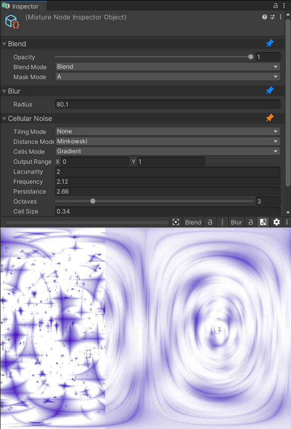

# Node Inspector

The node inspector is a powerful tool that allow you to compare previews between two selected nodes, access advanced node features and more!

## Selection and Pinned nodes

When you select nodes in the graph, they will appear in the node inspector. You can also pin nodes using the small **Needle Note** icon on top of the node. When you pin a node, it will stay in the inspector no matter what you select.

The selection is based on a stack system, selected items are placed on top of the stack (i.e. on top of the inspector) and pined items are at the bottom. This allows you to easily access a node without settings without scrolling to find it in the inspector.

## Preview and Comparison

The preview uses the first (or two first in comparison mode) previews of the nodes in the inspector stack. In the image above, the first two selected nodes are being compared side by side.

You can use these controls in the preview area

Control | Action
--- | ---
left/middle click drag | pan the preview texture
mouse wheel | zoom in the texture
right click drag | in comparison mode, changes the comparison slider value

In the preview header bar, you'll find a button to center the preview, as well as the selected preview name and a button to clock it. When you lock a preview, the preview will stay no matter what node you select / un-select. Then you have the icon to enable the comparison mode and finally the settings.

When comparing two images, you can click on the **|** symbol to change the comparison mode, by default it uses side by side comparison but you have onion skin and diff modes as well.
