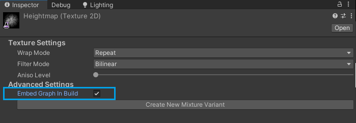

# mixture Scripting

## Accessing the mixture graph

The best way to access a Mixture in C# is to expose a Texture parameter and then do a call to `GetGraphFromTexture` to retrieve the `MixtureGraph` object like in this example:


```CSharp
public class ProcessMixture : MonoBehaviour
{
    public Texture graphTexture;

    void Start()
    {
        var graph = MixtureDatabase.GetGraphFromTexture(graphTexture);
        ...
    }
}
```

Accessing a MixtureGraph in build can be a bit different, especially if you need to access a Static mixture graph. By default these graphs are stripped out from the build to avoid adding unnecessary weight to the game, but if you need it you can force the graph to be embedded in the build by ticking the `Embed Graph In Build` option in the Mixture asset inspector:



Realtime Mixture graphs don't have this problem because their graph is needed for the update so they are always included in builds.

## Setting Parameters

To set a parameter, use the `SetParameterValue` function on the `MixtureGraph`, you need to pass the name of the parameter and it's value to the function. If the parameter doesn't exist, the function will return false.


Example:

```CSharp
graph.SetParameterValue("Source", source);
graph.SetParameterValue("Target", target);
```

## Processing the graph:

To process the graph, you just need to call `MixtureGraphProcessor.RunOnce(graph)` with the graph in parameter.

Note that when you process a realtime mixture graph, the main texture asset is automatically updated. For static mixtures you need to manually call `SaveAllTextures()` on the mixture graph to trigger the readback and texture compression process (this function is only available in the editor).

## Getting the results

If you need to read back the result from a graph, there are several way to do that. The simplest is to use the parameter mode `Set` and get the value back with the `GetParameterValue` in the `MixtureGraph` class.


To get the result texture from a static mixture graph, use the `ReadbackMainTexture(texture)` function in the Mixture graph like so:

```CSharp
// Process the graph
MixtureGraphProcessor.RunOnce(graph);

// Create the destination texture
var settings = graph.outputNode.settings;
Texture2D destination = new Texture2D(
    settings.GetResolvedWidth(graph),
    settings.GetResolvedHeight(graph),
    settings.GetGraphicsFormat(graph),
    TextureCreationFlags.None
);

// Readback the result
graph.ReadbackMainTexture(destination);
```