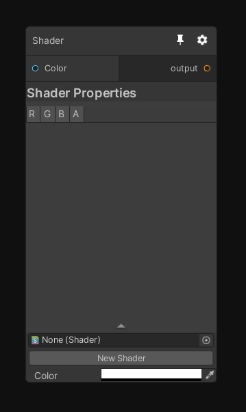

# Shader Nodes

In Mixture, Shader Nodes are nodes that contains a single shader and a single output texture. Their behavior is really simple: they execute the shader on a quad with the current resolution of the node.

Note that the shader must be compatible with [Custom Render Texture](https://docs.unity3d.com/Manual/class-CustomRenderTexture.html) to be valid.

## Creating a new Shader node

### Shader Node

The Shader node allow you to reference a shader and execute it. By default when creating a "Shader Node", the shader is set to None and do nothing.



Click the "New Shader" button to create either a new ShaderGraph or text shader compatible with this node.

Alternatively you can create the shader in the context menu with "Assets/Create/Mixture/Fixed Shader" or "Fixed Shader Graph" for the graph variant.

This node is perfect to prototype something or if you need a node that you'll only use in a single graph.

Note that all the properties you expose in the ShaderGraph/text shader are directly reflected to this node, so it's easy to integrate in the graph.

Example with the HSV shader:  


### C# Shader Node

If you want to create a true node, accessible from the node creation menu that you can reuse very often in any graph you want, then you'll have to create a C# version of the node. To create the C# template file go to "Assets/Create/Mixture/C# Fixed Shader Node"


The file created will look like this

```CSharp
using System.Collections;
using System.Collections.Generic;
using UnityEngine;
using GraphProcessor;
using System.Linq;

namespace Mixture
{
	[System.Serializable, NodeMenuItem("Custom/MyNode")]
	public class MyNode : FixedShaderNode
	{
		public override string name => "MyNode";

		public override string shaderName => "Hidden/Mixture/MyNode";

		public override bool displayMaterialInspector => true;

		// Enumerate the list of material properties that you don't want to be turned into a connectable port.
		protected override IEnumerable<string> filteredOutProperties => new string[]{};

		// Override this if you node is not compatible with all dimensions
		// public override List<OutputDimension> supportedDimensions => new List<OutputDimension>() {
		// 	OutputDimension.Texture2D,
		// 	OutputDimension.Texture3D,
		// 	OutputDimension.CubeMap,
		// };
	}
}
```

Technically you only have to change the `shaderName` property to the name of your shader (for ShaderGraph it's `Shader Graphs/name of your graph` by default) to get your node working. But there are probably a couple of other things you'll need to change, so here's the list of properties you can change and how it will affect the node:

property | description
--- | ---
NodeMenuItem("Custom/MyNode") | The path of your node in the create menu
name | The name of the shader in the graph
displayMaterialInspector | Do you use the default material inspector (if you don't have a custom node view, leave true)
filteredOutProperties | List of the shader properties that you don't want to show as ports (by default all shader properties are available as a node port, even enums)
supportedDimensions | List of the supported dimensions by your node.
defaultRTSettings | override the default settings of the node.

Note that if you node only support 2D, you'll need to add this bit of code:

```CSharp
protected override MixtureRTSettings defaultRTSettings
{
    get {
        var rts = MixtureRTSettings.defaultValue;
        rts.dimension = OutputDimension.Texture2D;
        return rts;
    }
}
```

It prevents the node to take the current graph texture dimension as output (i.e if you are editing a cubemap graph but want to use a normal rotate node (only compatible with 2D) without this code, the node will be executed on a cubemap instead of a texture 2D).

## Node Documentation

A node can be documented at different levels:

The first is shader documentation, add a tooltip drawer on your shader properties like this `[Tooltip(This input does something)]`. Note that the same attribute exists in C# too.
The second is C# documentation, it's done with a `[Documentation]` attribute that supports markdown, example:

```CSharp
	[Documentation(@"
Perform an addition with `source A`, `source B` and Color and writes the result to output like so:
``
_Output = _SourceA + _SourceB + _Value;
``
")]
```

You can place this attribute directly on the node class.

That's all! A script that generates the documentation from the tooltips and Documentation attribute will update the doc website automatically.

## Contributing

If you think your node could have it's place in the Mixture package, then let us know! [create a pull request](https://github.com/alelievr/Mixture/pulls) and we'll review your work, but don't forget the documentation :) 