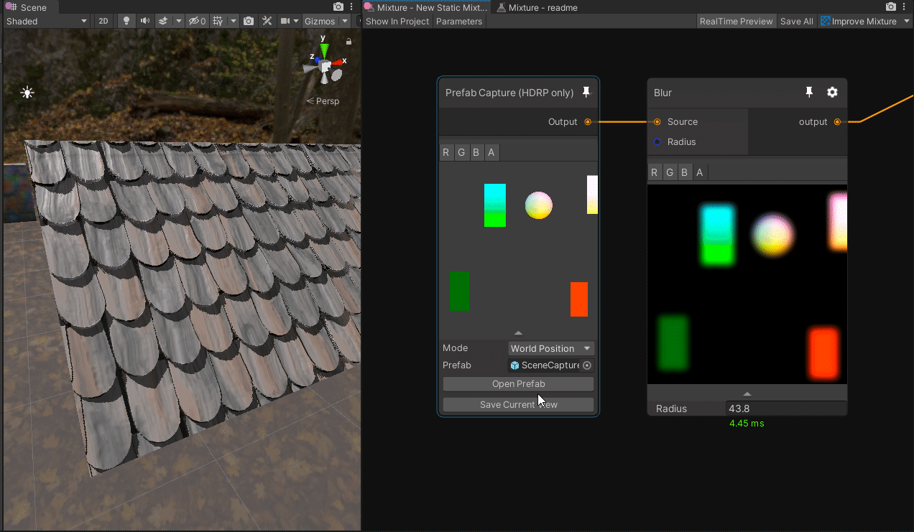

Mixture is a powerful node-based tool crafted in unity to generate all kinds of textures in realtime. Mixture is very flexible, easily customizable through [ShaderGraph](https://unity.com/shader-graph) and a simple C# API, fast with it's GPU based workflow and compatible with all the render pipelines thanks to the new [Custom Render Texture](https://docs.unity3d.com/2020.2/Documentation/ScriptReference/CustomRenderTextureManager.html) API.


# Getting Started

## Installation

You need at least a Unity 2020.2 beta to be able to use Mixture and if you are using a render pipeline like URP or HDRP, make sure tu use the version 10.1.0 or above.

[](https://openupm.com/packages/com.alelievr.mixture/)

Mixture is available on the [OpenUPM](https://openupm.com/packages/com.alelievr.mixture/) package registry, to install it in your project, follow the instructions below.

1. Open the `Project Settings` and go to the `Package Manager` tab.
2. In the `Scoped Registry` section, click on the small plus icon to add a new [scoped registry](https://docs.unity3d.com/2020.2/Documentation/Manual/upm-scoped.html).
3. In `Name` you can put `Open UPM`, the `URL` is `https://package.openupm.com` and scope is `com.alelievr`
4. Then below the scoped registries, you need to enable `Preview Packages` (Mixture is still in preview).
5. Next, open the `Package Manager` window, select `My Registries` in the top left corner and you should be able to see the Mixture package.
6. Click the `Install` button and you can start using Mixture :)


If you don't have `My Registries` in the dropdown for somne reason, just open your `manifest.json` and paste this (you can change the version number to the latest available on
[OpenUPM](https://openupm.com/packages/com.alelievr.mixture/))
```JSON
    "com.alelievr.mixture": "0.0.4",
```

Note that sometimes, the package manager can be slow to update the list of available packages. In that case, you can force it by clicking the circular arrow button at the bottom of the package list.

## Documentation

You can consult the getting started guide here: https://alelievr.github.io/Mixture/manual/GettingStarted.html

As well as the Node Library here: https://alelievr.github.io/Mixture/manual/nodes/NodeLibraryIndex.html

And finally, you can find some Mixture examples here: https://alelievr.github.io/Mixture/manual/Examples.html

# Bugs / Feature Requests

Bugs and features requests are logged using the github issue system. To report a bug, request a feature, or simply ask a question, simply [open a new issue](https://github.com/alelievr/Mixture/issues/new/choose).

# How to contribute 

Your contributions are much appreciated even small ones, we'll review them and eventually merge them.

If you want to add a new node, you can check out [this documentation page on how to create a new shader-based node](https://alelievr.github.io/Mixture/manual/ShaderNodes.html). Once you have it working, you can prepare your pull request.
In case you have any questions about a feature you want to develop of something you're not sure how to do, you can still create a draft pull request to discuss the implementation details.

# Gallery / Cool things

You can open a Mixture graph just by double clicking any texture field in the inspector with a Mixture assigned to it.


[Surface Gradient](https://blogs.unity3d.com/2019/11/20/normal-map-compositing-using-the-surface-gradient-framework-in-shader-graph/) powered normal map operations.


Extract buffers (depth, normal, color or position) from the rendering of a prefab and use it directly in the graph (HDRP Only).


Fractal nodes in Mixture:


Mixture Variants:

