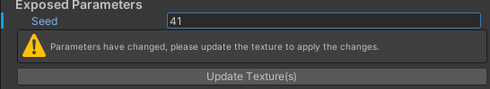

# Mixture Variants

Just like [prefab variants](https://docs.unity3d.com/Manual/PrefabVariants.html) you can create variants of mixture graphs and override their parameters. Just like mixture graph, variants exists with two different modes: static and realtime. The mode is determined by the parent of the variant, if the parent graph is static, then the variant will be static too and vice versa.

You can also create variants of variants and you can keep track of the variant hierarchy with the breadcrumb bar at the top of the mixture variant inspector.

## Introduction

The simplest way to create a Mixture variant is to go in the inspector of a Mixture Graph and click the button "Create New Mixture Variant" at the bottom of the UI

Alternatively, you can also create a variant from the project window by right clicking on a mixture asset and selecting **Create > Mixture > Variant**.

Once the variant is created, in the inspector you have the list of exposed parameters from the Mixture Graph. Changing the value of those parameters will add a small blue line on the left of the field saying that the property value is overwritten by the variant.

You can reset the overwritten values by right clicking on them and selecting **Reset**.

## Static Variants

Just like static Mixture graphs, the static variants saves the result of the processing in on the disk, so it means that when you change a parameter, you'll need to click the "Update Texture(s)" button in the UI to update the assets on the disk.

Whenever the textures on the disk needs to be updated (for example if something has changed in the variant hierarchy), a warning box will tell you press the update button to apply the changes to the textures on the disk.

## Realtime Variants

Realtime Variants works identically as static variants but instead of having to save the assets on the disk when a parameter changes, the render textures are automatically updated.
Note that each mixture variant allocate a different RenderTexture to store it's result which may increase a lot your GPU memory usage if overused.

## Example

https://user-images.githubusercontent.com/6877923/115474571-03c75800-a23e-11eb-8096-8973aad5fa9f.mp4
