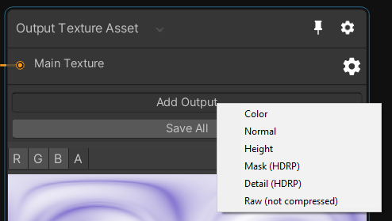

# Mixture in HDRP and URP

Mixture is compatible with built-in render pipeline but also HDRP and URP and add a couple of feature related to these pipelines which makes easier to work with certain features.

## HDRP

For HDRP, you can use these 3 nodes:

The two first allow you to create a [Mask Map and a Detail Map for HDRP materials](https://docs.unity3d.com/Packages/com.unity.render-pipelines.high-definition@latest/index.html?subfolder=/manual/Mask-Map-and-Detail-Map.html).

The Prefab Capture node is much more interesting: it allows you to take an image from a camera in a prefab, you can extract different buffers from the camera like in this example where the world position is captured. Please refer to the documentation for more in-depth explanation.

You also have HDRP Mask and Detail map presets in the output texture asset node.

I've been thinking about adding a Mixture [Custom Pass](https://docs.unity3d.com/Packages/com.unity.render-pipelines.high-definition@latest/index.html?subfolder=/manual/Custom-Pass.html) to allow you to create complex multi-pass effects without writing a single line of code. If you're interested you can vote on the [trello card task](https://trello.com/c/h6j8yn7O/160-mixture-support-in-hdrp-custom-pass).

## URP

There is not much to say about the support of URP, but I've been thinking to add a mixture scriptable render pass in URP that would allow you to create multi-pass effects with mixture in realtime. You can vote on the [trello card task](https://trello.com/c/X0LnzMOL/172-mixture-support-in-urp-scriptable-render-pass) if you're interested.
