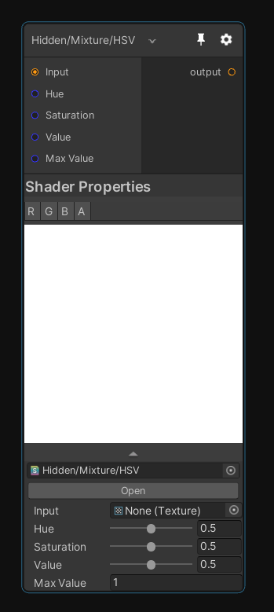
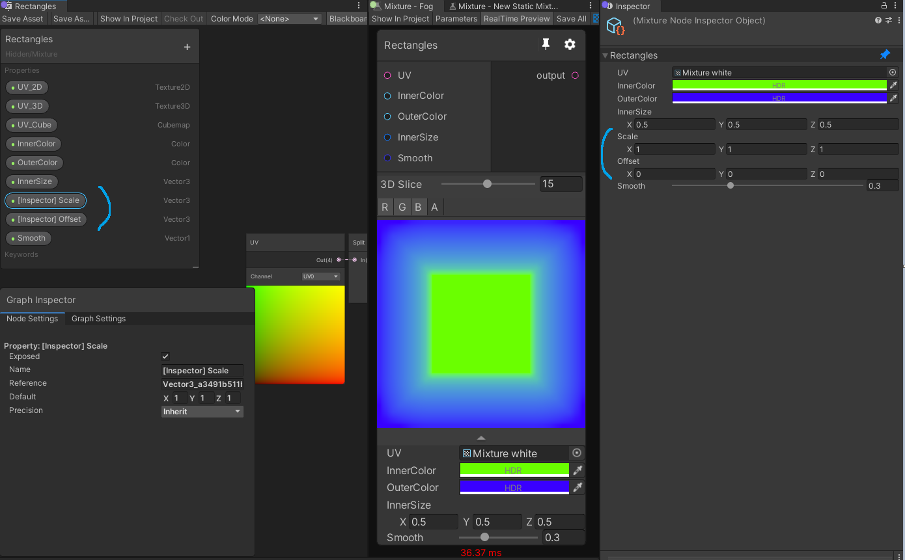
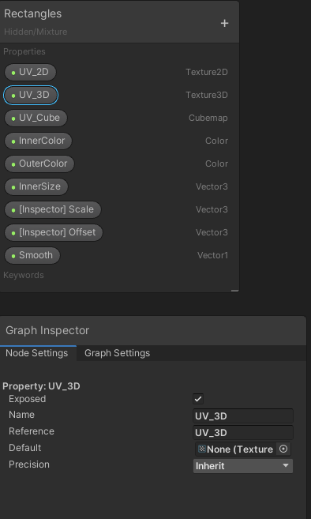
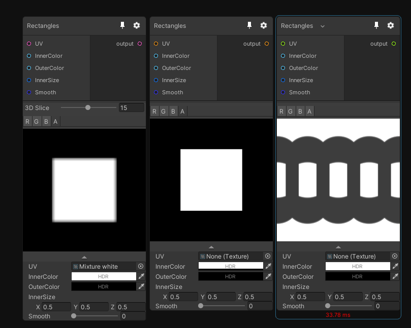
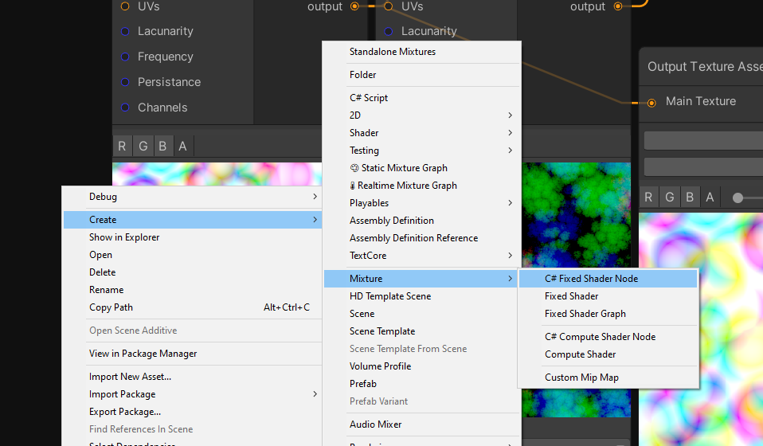

# Shader Nodes

In Mixture, Shader Nodes are nodes that contains a single shader and a single output texture. Their behavior is really simple: they execute the shader on a quad with the current resolution of the node.

Note that the shader must be compatible with [Custom Render Texture](https://docs.unity3d.com/Manual/class-CustomRenderTexture.html) to be valid.

## Create a simple Shader Node 

The Shader node allow you to reference a shader and execute it. By default when creating a "Shader Node", the shader is set to None and do nothing.


Click the "New Shader" button to create either a new ShaderGraph or text shader compatible with this node.

Alternatively you can create the shader in the context menu with "Assets/Create/Mixture/Fixed Shader" or "Fixed Shader Graph" for the graph variant.

This node is perfect to prototype something or if you need a node that you'll only use in a single graph.

Note that all the properties you expose in the ShaderGraph/text shader are directly reflected to this node, so it's easy to integrate in the graph.

Example with the HSV shader:  


## Shader Advanced Use Cases

When you create your shader for a Shader Node, you have some extra features that you can use to help you creating a good node.

### Expose a property only visible in the inspector

In ShaderGraph, if you prefix a property with `[Inspector]` then you can make this property only show in the inspector instead of in the node GUI. As you can see in this example with the **Rectangles** shader node, in the ShaderGraph, we have Scale and Offset with the inspector tag, and these properties are only displayed in the inspector.  


This feature also exist in hand-written shader with this syntax:
```hlsl
		[ShowInInspector]_Property_("Display Name", Int) = 42
```

### UV with 2D, 3D and Cube textures

When you create a node compatible with every kind of texture it can be complicated to deal with UVs for 2D, 3D and cubemap textures.

This is why we added the UV/Direction node in ShaderGraph:


It have different behavior based on the dimension of the current custom render texture executed:

Dimension | Return
--- | ---
2D | standard fullscreen UV between 0 and 1 in x and y and 0.5 constant in z
3D | same as 2D for x and y but z contains the current 3D texture slice between 0 and 1
Cube | contains the direction vector and can be directly used to sample a cubemap

There is not really an equivalent for hand-written shader but there is this function which allows you to sample a texture independently from the dimension:
```hlsl
TEXTURE_SAMPLER_X(_Source);
...

float4 mixture (v2f_customrendertexture i) : SV_Target
{
	return SAMPLE_X(_Source, i.localTexcoord.xyz, i.direction);
}
```

This is a valid code that will sample a 2D, 3D or cube texture and write it to the 2D, 3D or cube output render target. Note that you need to include `Packages/com.alelievr.mixture/Runtime/Shaders/MixtureFixed.hlsl` to access these macros.

### Expose a Texture with multiple dimensions

In ShaderLab and ShaderGraph, to expose a texture you must specify a Dimension and when you create a shader node compatible with multiple dimension you need to declare each texture one time per supported dimension like this:

```hlsl
_Source_2D("Source", 2D) = "black" {}
_Source_3D("Source", 3D) = "black" {}
_Source_Cube("Source", Cube) = "black" {}
```

You then obviously don't want to display all those properties on the node, you only want to show the one that are relevant for your current dimension. You can achieve this if you add the dimension as a suffix in the reference name of the property just like above.

In ShaderGraph it's done like this:



And the result is a node that update it's input texture type based on the target dimension: (notice the port color change)


Note that the above dimension suffix works for all kind of properties such as Float or Vectors, so you can have dimension specific parameters with this feature.

## C# Shader Node

If you want to create a true node, accessible from the node creation menu that you can reuse very often in any graph you want, then you'll have to create a C# version of the node. To create the C# template file go to "Assets/Create/Mixture/C# Fixed Shader Node"




The file created will look like this

```CSharp
using System.Collections;
using System.Collections.Generic;
using UnityEngine;
using GraphProcessor;
using System.Linq;

namespace Mixture
{
	[System.Serializable, NodeMenuItem("Custom/MyNode")]
	public class MyNode : FixedShaderNode
	{
		public override string name => "MyNode";

		public override string shaderName => "Hidden/Mixture/MyNode";

		public override bool displayMaterialInspector => true;

		// Enumerate the list of material properties that you don't want to be turned into a connectable port.
		protected override IEnumerable<string> filteredOutProperties => new string[]{};

		// Override this if you node is not compatible with all dimensions
		// public override List<OutputDimension> supportedDimensions => new List<OutputDimension>() {
		// 	OutputDimension.Texture2D,
		// 	OutputDimension.Texture3D,
		// 	OutputDimension.CubeMap,
		// };
	}
}
```

Technically you only have to change the `shaderName` property to the name of your shader (for ShaderGraph it's `Shader Graphs/name of your graph` by default) to get your node working. But there are probably a couple of other things you'll need to change, so here's the list of properties you can change and how it will affect the node:

property | description
--- | ---
NodeMenuItem("Custom/MyNode") | The path of your node in the create menu
name | The name of the shader in the graph
displayMaterialInspector | Do you use the default material inspector (if you don't have a custom node view, leave true)
filteredOutProperties | List of the shader properties that you don't want to show as ports (by default all shader properties are available as a node port, even enums)
supportedDimensions | List of the supported dimensions by your node.
defaultRTSettings | override the default settings of the node.

Note that if you node only support 2D, you'll need to add this bit of code:

```CSharp
protected override MixtureRTSettings defaultRTSettings
{
    get {
        var rts = MixtureRTSettings.defaultValue;
        rts.dimension = OutputDimension.Texture2D;
        return rts;
    }
}
```

It prevents the node to take the current graph texture dimension as output (i.e if you are editing a cubemap graph but want to use a normal rotate node (only compatible with 2D) without this code, the node will be executed on a cubemap instead of a texture 2D).

## Node Documentation

A node can be documented at different levels:

The first is shader documentation, add a tooltip drawer on your shader properties like this `[Tooltip(This input does something)]`. Note that the same attribute exists in C# too.
The second is C# documentation, it's done with a `[Documentation]` attribute that supports markdown, example:

```CSharp
	[Documentation(@"
Perform an addition with `source A`, `source B` and Color and writes the result to output like so:
``
_Output = _SourceA + _SourceB + _Value;
``
")]
```

You can place this attribute directly on the node class.

That's all! A script that generates the documentation from the tooltips and Documentation attribute will update the doc website automatically.

## Contributing

If you think your node could have it's place in the Mixture package, then let us know! [create a pull request](https://github.com/alelievr/Mixture/pulls) and we'll review your work, but don't forget the documentation :) 