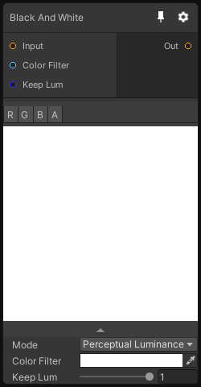

# Black And White

## Inputs
Port Name | Description
--- | ---
Input | Source Texture
Color Filter | 
Keep Lum | 

## Output
Port Name | Description
--- | ---
output | 

## Description
Convert RGB image to White and Black. With the Mode property you can change how the black and white color is computed:

Name | Description
--- | ---
Perceptual Luminance | Compute the luminance with this RGB factor: 0.299, 0.587, 0.114
D65 Luminance | Compute the luminance with D65 standard RGB factor: 0.2126729, 0.7151522, 0.0721750
Custom Luminance | Compute the luminance the custom value "Lum Factors" in the inspector.
Lightness | Compute the lightness with `( max(R, G, B) + min(R, G, B) ) / 2`
Average | Compute the average with `( R + G + B ) / 3`

