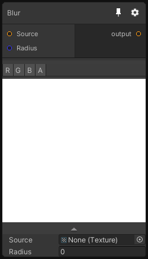

# Blur

## Inputs
Port Name | Description
--- | ---
Source | Source Texture
Radius | Blur radius in pixels

## Output
Port Name | Description
--- | ---
Out | 

## Description
Gaussian blur filter in two passes. You might see some artifacts with large blur values because there is a fixed amount of samples (64) in the shader.

