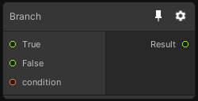

# Branch

## Inputs
Port Name | Description
--- | ---
condition | 
False | 
True | 

## Output
Port Name | Description
--- | ---
Result | 

## Description
Conditionally outputs either the true of false value depending on the condition value.

