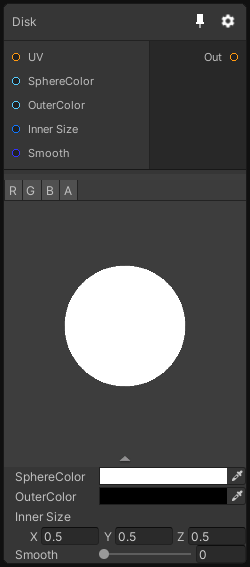

# Disk

## Inputs
Port Name | Description
--- | ---
UV | 
SphereColor | 
OuterColor | 
Inner Size | 
Smooth | 

## Output
Port Name | Description
--- | ---
Out | 

## Description
Generate a Disk, in 3D this node generate a solid spheres.

