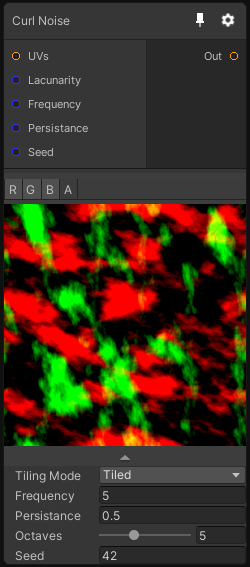

# Curl Noise

## Inputs
Port Name | Description
--- | ---
UVs | 
Lacunarity | 
Frequency | 
Persistance | 
Seed | 

## Output
Port Name | Description
--- | ---
Out | 

## Description
Curl noise is similar math to the Perlin Noise, but with the addition of a curl function which allows it to generate a turbulent noise.
This resulting noise is incompressible (divergence-free), which means that the genearted vectors cannot converge to sink points.

The output of this node is a 2D or 3D vector field (normalized vector direction).

