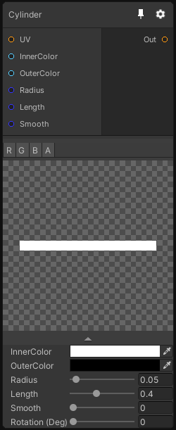

# Cylinder

## Inputs
Port Name | Description
--- | ---
UV | 
InnerColor | 
OuterColor | 
Radius | 
Length | 
Smooth | 

## Output
Port Name | Description
--- | ---
Out | 

## Description
Generates a line pattern. In 3D this node generate cylinders using a signed distance field function.

