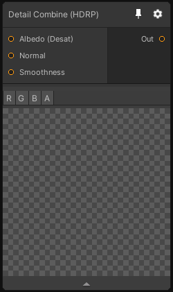

# Detail Combine (HDRP)

## Inputs
Port Name | Description
--- | ---
Albedo (Desat) | 
Normal | 
Smoothness | 

## Output
Port Name | Description
--- | ---
output | 

## Description
Generates an HDRP detail map by combining the desaturated albedo, normal and smoothness maps.
See [HDRP Detail Map Documentation](https://docs.unity3d.com/Packages/com.unity.render-pipelines.high-definition@latest/index.html?subfolder=/manual/Mask-Map-and-Detail-Map.html for more information)

