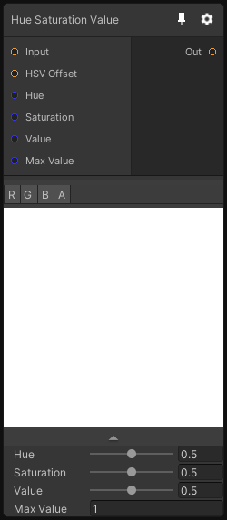

# Hue Saturation Value

## Inputs
Port Name | Description
--- | ---
Input | 
HSV Offset | 
Hue | 
Saturation | 
Value | 
Max Value | For HDR images, you need to specify the maximum value of your image

## Output
Port Name | Description
--- | ---
Out | 

## Description
Modify the image in the HSV color space.

