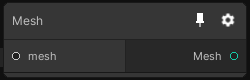

# Mesh

## Inputs
Port Name | Description
--- | ---
mesh | 

## Output
Port Name | Description
--- | ---
Mesh | 

## Description
Mesh in mixture, it also have transform a so you can apply any kind of transform operation, it will be applied when the node is processed.

