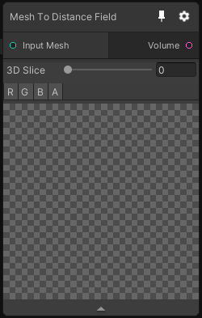

# Mesh To Distance Field

## Inputs
Port Name | Description
--- | ---
Input Mesh | 

## Output
Port Name | Description
--- | ---
Volume | 

## Description
Transform a Mesh into a distance field. The distance field can be either signed or unsigned depending on the mode.

Note that the unsigned distance field is faster to compute.

