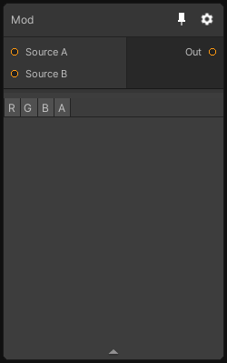

# Mod

## Inputs
Port Name | Description
--- | ---
Source A | 
Source B | 

## Output
Port Name | Description
--- | ---
Out | 

## Description
Perform a modulo with `source A` and `source B`and writes the result to output like so:
```
_Output = _SourceA % _SourceB;
```

