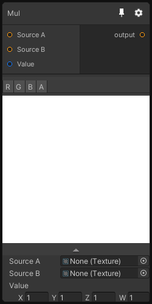

# Mul

## Inputs
Port Name | Description
--- | ---
Source A | 
Source B | 
Value | 

## Output
Port Name | Description
--- | ---
output | 

## Description
Perform a multiplication with `source A`, `source B` and Vector and writes the result to output like so:
```
_Output = _SourceA * _SourceB * _Value;
```

