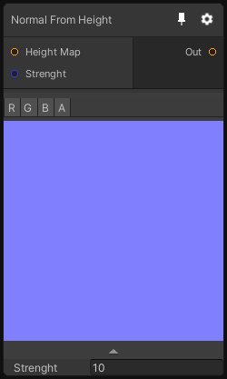

# Normal From Height

## Inputs
Port Name | Description
--- | ---
Height Map | 
Strenght | 

## Output
Port Name | Description
--- | ---
Out | 

## Description
Generate a Normal map from an Height map. This node uses the surface gradient technique to perform this operation.

Please note that this node only support Texture2D dimension(s).
