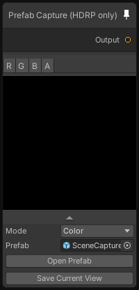

# Prefab Capture (HDRP)

## Output
Port Name | Description
--- | ---
Output | 

## Description
Renders the content of the prefab using the camera at the root of the prefab.
You can use choose to output different buffers from the prefab: Color, Depth, World Normal, Tangent or World Position.
The alpha channel is used to know whether an object is here or not (0 means nothing and 1 object).

Opening the prefab will switch to a render texture so you can visualize the changes in real-time in the graph.
When you are satisfied with the setup in the prefab, click on 'Save Current View' to save the texture as sub-asset of the graph, you cna the close the prefab and the scene node will use this baked texture as output.

Note that this node is currently only available with HDRP.

