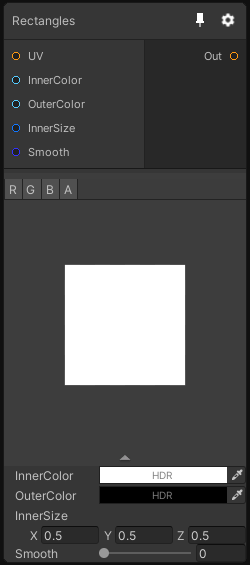

# Rectangles

## Inputs
Port Name | Description
--- | ---
UV | 
InnerColor | 
OuterColor | 
InnerSize | 
Smooth | 

## Output
Port Name | Description
--- | ---
Out | 

## Description
Generate a rectangle pattern. In 3D this node generates cuboid shapes.

