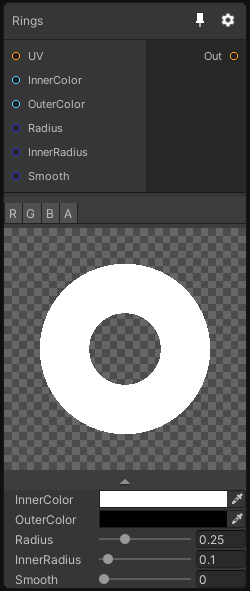

# Rings

## Inputs
Port Name | Description
--- | ---
InnerColor | 
OuterColor | 
Radius | 
InnerRadius | 
Smooth | 

## Output
Port Name | Description
--- | ---
output | 

## Description
Generates a ring pattern. In 3D this node generate toruses.

