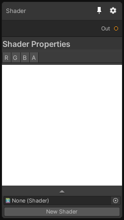

# Shader

## Output
Port Name | Description
--- | ---
Out | 

## Description
This node is the base node of all shader operations, it allows you to create a node with a custom behavior by putting a shader in the Shader field.
Note that the shader must be compatible with Custom Render Textures, otherwise it won't work. If you have a doubt you can create a new shader by pressing the button "New Shader".

The node will automatically reflect the shader properties as inputs that you'll be able to connect to other nodes.
This can be especially useful to prototype a new node or just add something that wasn't in the node Library.

For more information, you can check the [Shader Nodes](../ShaderNodes.md) documentation page.

