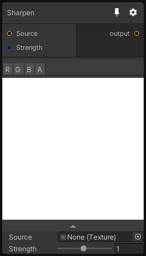

# Sharpen

## Inputs
Port Name | Description
--- | ---
Source | 
Strength | 

## Output
Port Name | Description
--- | ---
Out | 

## Description
Sharpen the input image using a very simple 3x3 sharpening kernel.

