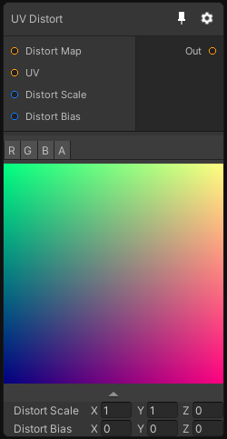

# UV Distort

## Inputs
Port Name | Description
--- | ---
Distort Map | 
UV | 
Distort Scale | 
Distort Bias | 

## Output
Port Name | Description
--- | ---
output | 

## Description
Apply a distortion to an UV texture. The distortion map must be encoded as vectors and doesn't have to be normalized.

If fact this node just adds an UV to the distoriton texture value after applying the scale and bias to it.

