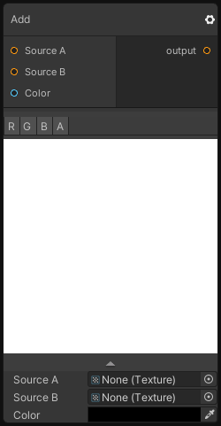

# Add

## Inputs
Port Name | Description
--- | ---
Source A | Input A
Source B | Input B
Value | Additional Value

## Output
Port Name | Description
--- | ---
Out | 

## Description
Perform an addition with `source A`, `source B` and Color and writes the result to output like so:
```
_Output = _SourceA + _SourceB + _Value;
```

