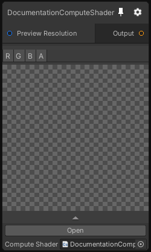

# DocumentationComputeShader

## Inputs
Port Name | Description
--- | ---
Preview Resolution | 

## Output
Port Name | Description
--- | ---
Output | 

## Description
Compute Shader Node behaves like the Shader Node but with a Compute Shader.
Note that this node tries to generate input / output based on the declared properties in the compute shader, see the compute shader template for more information.

