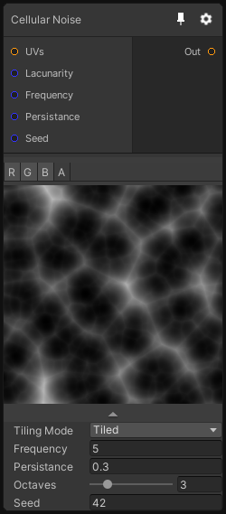

# Cellular Noise

## Inputs
Port Name | Description
--- | ---
UVs | Custom Noise UV
Lacunarity | 
Frequency | 
Persistance | 
Channels | Select how many noise to genereate and on which channel. The more different channel you use the more expensive it is (max 4 noise evaluation).

## Output
Port Name | Description
--- | ---
output | 

## Description
Voronoi/Cellular Noise generator.
This node is useful to generate cloud like textures, organic cellular patterns or more exotic patterns with stars using the Minkowski distance mode.

Note that for Texture 2D, the z coordinate is used as a seed offset.
This allows you to generate multiple noises with the same UV.
Be careful with because if you use a UV with a distorted z value, you'll get a weird looking noise instead of the normal one.

