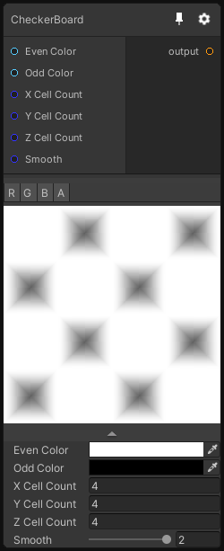

# CheckerBoard

## Inputs
Port Name | Description
--- | ---
UV | 
Even Color | 
Odd Color | 
X Cell Count | 
Y Cell Count | 
Z Cell Count | 
Smooth | 

## Output
Port Name | Description
--- | ---
Out | 

## Description
Generate a checkerboard patter, in 3D this node generates a cubic checkerboard pattern.

