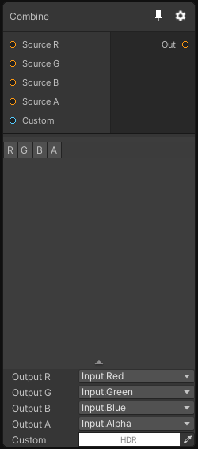

# CombineNode

## Inputs
Port Name | Description
--- | ---
Source R | Source Texture for the R channel
Source G | Source Texture for the G channel
Source B | Source Texture for the B channel
Source A | Source Texture for the A channel
Custom | 

## Output
Port Name | Description
--- | ---
output | 

## Description
Combine up to 4 textures into one, allowing you to choose which channel to write in the output texture.

Note that for creating HDRP Mask and Detail maps, there are dedicated nodes.

