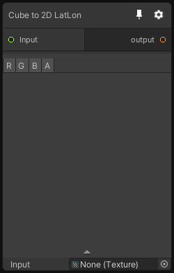

# Cube to 2D LatLon

## Inputs
Port Name | Description
--- | ---
Input | 

## Output
Port Name | Description
--- | ---
output | 

## Description
Transform a cubemap into a 2D texture using the LatLong convertion function.

