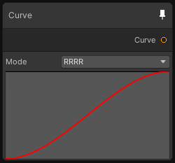

# Curve

## Output
Port Name | Description
--- | ---
Curve | 

## Description
Generate a texture based on curves, you can choose to have a different curve per channel with the Mode property.
This node is a great alternative to the gradient because it's not limited to 8 keys!

Note that the internal texture resolution is 512x1 pixels and the format is 32 bit float per channel.

