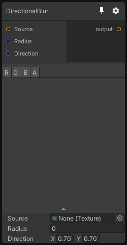

# DirectionalBlur

## Inputs
Port Name | Description
--- | ---
Source | 
Radius | Radius of the blur kernel, you have a good quality under 64 pixel of radius
Direction | Direction vector, note that it does not have to be normalized

## Output
Port Name | Description
--- | ---
output | 

## Description
Blur the input texture using a Gaussian filter in the specified direction.

Note that the kernbel uses a fixed number of 32 samples, for high blur radius you may need to use two directional blur nodes.

