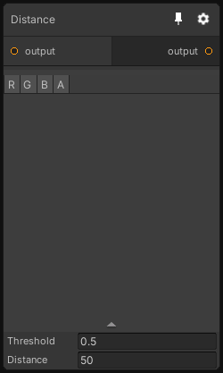

# Distance

## Inputs
Port Name | Description
--- | ---
input | 

## Output
Port Name | Description
--- | ---
output | 

## Description
Execute a flood fill operation on all pixels above the specified threshold.

Note that the computational cost of this node only depends on the texture resolution and not the distance parameter.

Smooth is only in alpha

