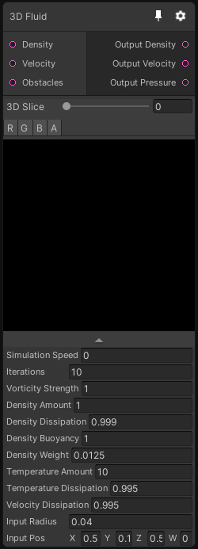

# 3D Fluid

## Inputs
Port Name | Description
--- | ---
Obstacles | 
Velocity | 
Density | 

## Output
Port Name | Description
--- | ---
Output Pressure | 
Output Velocity | 
Output Density | 

## Description

