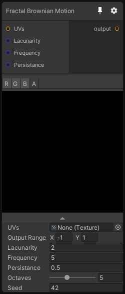

# Fractal Brownian Motion

## Inputs
Port Name | Description
--- | ---
UVs | 
Lacunarity | 
Frequency | 
Persistance | 

## Output
Port Name | Description
--- | ---
output | 

## Description
Generate a noise using multiple octaves of perlin noise, combined using the Fractal Brownian motion algorithm.

