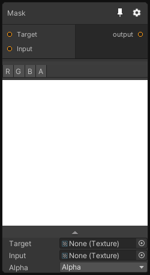

# Mask

## Inputs
Port Name | Description
--- | ---
Target | 
Input | 

## Output
Port Name | Description
--- | ---
output | 

## Description
Sample the target texture and mask it using input texture. Note that the mask is written in the alpha channel of the output.

