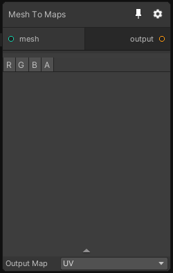

# Mesh To Maps

## Inputs
Port Name | Description
--- | ---
mesh | The mesh from where the attributes will be extracted

## Output
Port Name | Description
--- | ---
output | 

## Description
This node allows to extract the information in a mesh and output it as a texture.

This process is done using the UV of the mesh to flatten it and output it's attribtues. You can select which mesh attribute you want to output with the Output Map field.

