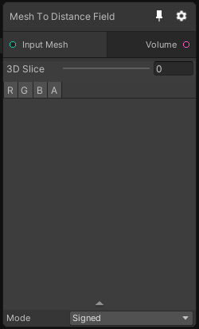

# Mesh To UDF

## Inputs
Port Name | Description
--- | ---
Input Meshes | 

## Output
Port Name | Description
--- | ---
Volume | 

## Description
Transform a Mesh into an Unsigned distance field. note that the output 3D texture is unsigned, it means that you can't know if a point is within of outside of the volume, you only know the distance to the closest boundary.

Note that currently, there is no mesh to signed distance field node.

