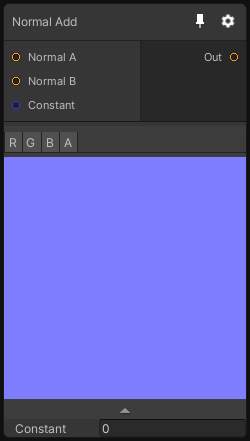

# Normal Add

## Inputs
Port Name | Description
--- | ---
Normal A | 
Normal B | 
Constant | 

## Output
Port Name | Description
--- | ---
output | 

## Description
Add two normal maps using the surface gradient functions.

Please note that this node only support Texture2D dimension(s).
