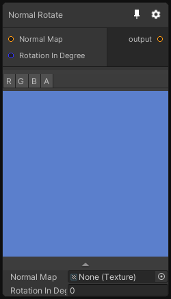

# Normal Rotate

## Inputs
Port Name | Description
--- | ---
Normal Map | 
Rotation In Degree | 

## Output
Port Name | Description
--- | ---
output | 

## Description
Rotate the normal map vector with a certain angle in degree.

