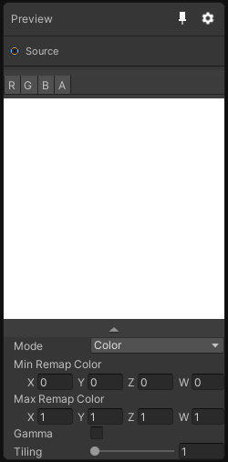

# Preview

## Inputs
Port Name | Description
--- | ---
Source | 

## Description
The Preview node allows you to visualize your texture data differently using 3 modes.
- Color, it have a per-channel remap and a gamma option.
- Heightmap, choose between altitude or heat gradients, you also have a height remap option.
- Normal, display your normal in tangent or object space. Additionally, you can also visualize the lighting of your normal map (use the right click to change the position of the light).

