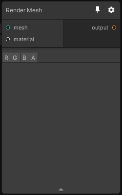

# Render Mesh

## Inputs
Port Name | Description
--- | ---
material | The material used to render the mesh
mesh | The mesh to be rendered

## Output
Port Name | Description
--- | ---
output | 

## Description
Renders a mesh using the material specified in the 'material' field.

