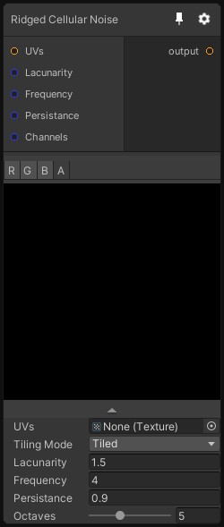

# Ridged Cellular Noise

## Inputs
Port Name | Description
--- | ---
UVs | 
Lacunarity | 
Frequency | 
Persistance | 
Channels | 

## Output
Port Name | Description
--- | ---
output | 

## Description

