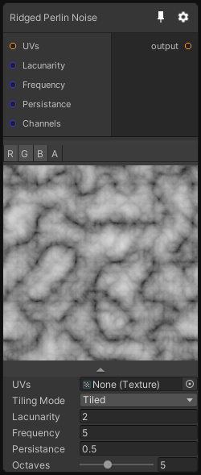

# Ridged Perlin Noise

## Inputs
Port Name | Description
--- | ---
UVs | 
Lacunarity | 
Frequency | 
Persistance | 
Channels | Select how many noise to genereate and on which channel. The more different channel you use the more expensive it is (max 4 noise evaluation).

## Output
Port Name | Description
--- | ---
output | 

## Description
Just like the perlin noise node, this one generate a cloudy pattern but the octaves are accumulated with an absolute function, which create these small "ridges" in the noise.

Note that for Texture 2D, the z coordinate is used as a seed offset.
This allows you to generate multiple noises with the same UV.
Be careful with because if you use a UV with a distorted z value, you'll get a weird looking noise instead of the normal one.

