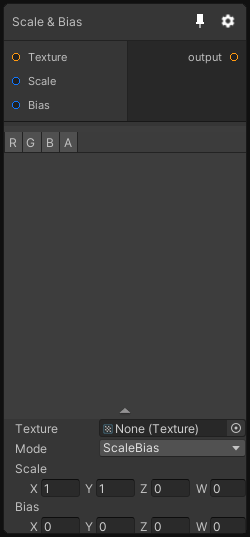

# Scale & Bias

## Inputs
Port Name | Description
--- | ---
Texture | 
Scale | 
Bias | 

## Output
Port Name | Description
--- | ---
Out | 

## Description
Apply a Scale and Bias on the input texture color.

