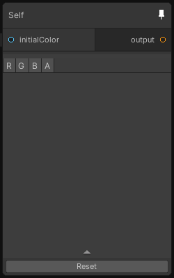

# Self

## Inputs
Port Name | Description
--- | ---
initialColor | 

## Output
Port Name | Description
--- | ---
output | 

## Description
The self node holds a copy of the output node last processing texture.
When the node is executed for the first time, the initialization color is used instead of the output texture.

Currently only the first output texture of the output node can be retrieved.

